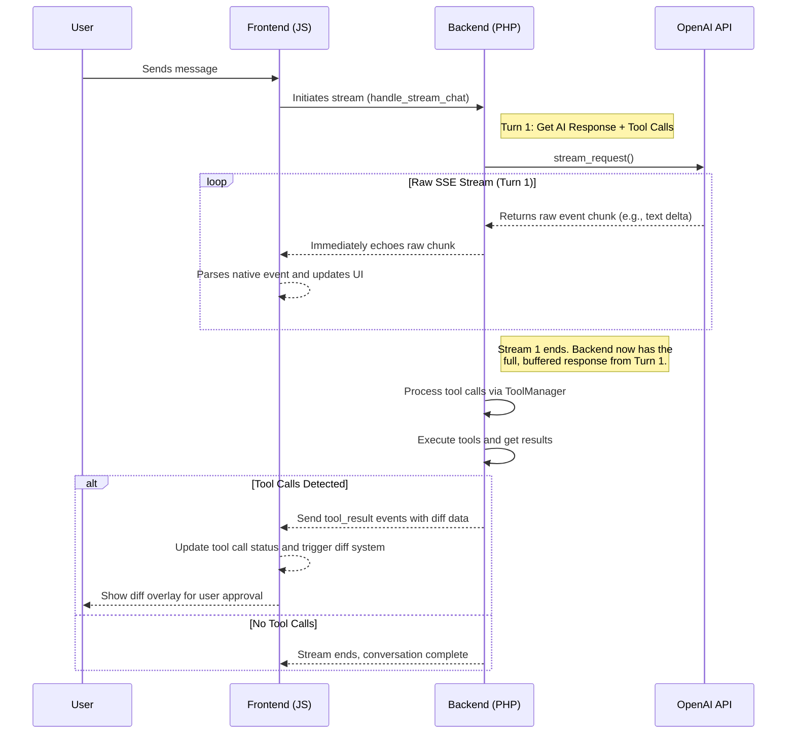

# Wordsurf Project Architecture

## Overview

Wordsurf is an agentic WordPress plugin that integrates AI agents directly into the editor. The plugin provides a chat interface where users can interact with an AI assistant that has access to modify WordPress content through a modular tool system.

## Core Architecture: Direct Streaming

The plugin's architecture is designed for a robust and low-latency user experience by streaming data directly from the OpenAI API to the browser. The PHP backend acts as a simple, authenticated proxy during the stream, and then handles heavier logic like tool execution after the stream is complete.

### High-Level Data Flow

### Tool Execution Flow

1. **AI Response**: OpenAI returns response with tool calls
2. **Tool Processing**: Backend processes tool calls via ToolManager
3. **Tool Execution**: Tools execute and return results with diff block content
4. **Result Delivery**: Backend sends tool results to frontend via SSE
5. **Diff Block Display**: Frontend inserts diff blocks into editor for user approval
6. **User Decision**: User accepts or rejects changes via diff block UI

### Backend Components

- **`Wordsurf_Chat_Handler`**: The main entry point for requests from the frontend. It verifies the user's nonce and permissions, sets up the `text/event-stream` headers, and calls the `Agent_Core` to handle the request. It accepts both GET and POST to be compatible with `EventSource`.

- **`Wordsurf_Agent_Core`**: The central orchestrator. It manages the conversation history, constructs the system prompt, and coordinates the two-turn process for tool calls. It does **not** parse the stream itself.

- **`Wordsurf_OpenAI_Client`**: A lightweight HTTP client. Its `stream_request` method is the heart of the direct streaming model. It opens a cURL connection to OpenAI and does two things simultaneously:
    1.  `echo`es every raw data chunk directly to the browser.
    2.  Buffers the entire raw response into a string, which it returns once the stream is complete.

- **`Wordsurf_Tool_Manager`**: Manages the lifecycle of all tools. After a stream is complete, its `process_and_execute_tool_calls` method is given the full, buffered API response. It is responsible for finding any `function_call` requests, executing the corresponding tools, and returning the results to the `Agent_Core`.

- **`Wordsurf_Context_Manager`**: Gathers contextual information about the current post to be included in the system prompt.

### Frontend Components

- **`WordsurfPlugin.js`**: The main plugin container component. It initializes the `useChatHandler` hook and manages the state for the UI, including pending diffs.

- **`useChatHandler` (in `ChatHandler.js`)**: A React hook that manages the entire state of a chat session. It sends messages, receives events from the stream, and updates the UI. It uses a `requestAnimationFrame` loop to batch text updates, ensuring a smooth, non-janky typing effect.

- **`streamChatMessage` (in `StreamApi.js`)**: This function uses the native browser **`EventSource`** API to connect to the backend. `EventSource` is specifically designed for handling Server-Sent Events (SSE) and is more robust and simpler than a manual `fetch` implementation. It listens for named events sent from OpenAI (e.g., `response.output_text.delta`) and passes them to the `useChatHandler`.

- **`ChatHistory.js`**: Manages conversation state and message formatting. Ensures assistant messages have proper `type: 'text'` and `author: 'agent'` fields for UI display.

- **`UIComponents.js`**: Contains the presentational React components for the chat interface, such as the message bubbles, input area, and "Thinking..." indicator.

### OpenAI Responses API

⚠️ **CRITICAL ARCHITECTURAL DECISION - DO NOT CHANGE** ⚠️

The plugin uses OpenAI's **Responses API** (`/v1/responses`) with the `gpt-4.1` model. This is a deliberate architectural decision that must **NOT** be reverted. The entire backend and frontend are built to handle the specific event-based format of this API.

- **Endpoint**: `https://api.openai.com/v1/responses`
- **Request Format**: Uses an `input` field for the message history.
- **Tool Result Format**: Uses a `function_call_output` object type for tool results.

## Tool System

All tools are managed by the `Wordsurf_Tool_Manager`. They are defined as classes that implement a basic interface for getting their name, description, and schema, and for executing their logic. Tool execution is handled entirely on the backend after the initial stream from the AI is complete.

## Diff Block System

The plugin uses custom Gutenberg blocks (`wordsurf/diff`) to handle AI-suggested changes with granular accept/reject functionality:

### Diff Block Features
- **Persistent Metadata**: Each diff block contains metadata about the change (diffId, type, original content, replacement content, status)
- **Granular Control**: Each AI suggestion gets its own block for individual accept/reject actions
- **Visual Feedback**: Clear visual indicators for different diff types (edit, insert, delete)
- **Accept/Reject UI**: Built-in buttons for accepting or rejecting changes
- **Block Replacement**: On accept/reject, the diff block is replaced with clean content

### Diff Block Types
- **Edit**: Shows original content and replacement content side by side
- **Insert**: Shows new content to be inserted
- **Delete**: Shows content to be removed

### Diff Block Lifecycle
1. **Creation**: Backend tools create diff block content with metadata
2. **Insertion**: Frontend inserts diff blocks into the editor
3. **Interaction**: User can accept or reject changes via block UI
4. **Replacement**: On action, diff block is replaced with clean content
5. **Cleanup**: Diff block is removed and editor state is updated

### Backend Integration
- Tools output diff block content instead of inline markup
- Each tool includes a `create_diff_block_content()` method
- Diff blocks include all necessary metadata for frontend handling
- Backward compatibility maintained for existing inline diff system
